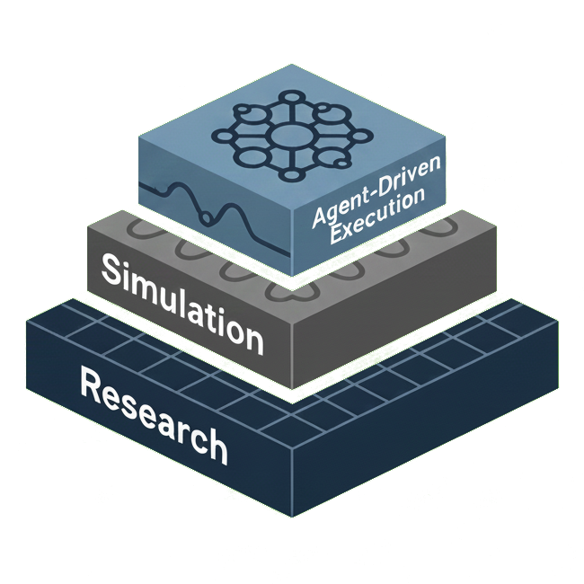

<p align="center">
  
</p>

<h1 align="center">QuantStack</h1>

<p align="center">
  <strong>Unified stack: QuantCore + QuantPod + QuantArena</strong>
</p>

<p align="center">
  <a href="https://www.python.org/downloads/"></a>
  <a href="https://opensource.org/licenses/Apache-2.0"></a>
</p>

<p align="center">
  <a href="docs/architecture/README.md">Architecture</a> •
  <a href="docs/guides/quickstart.md">Quick Start</a> •
  <a href="docs/api/index.md">API Reference</a> •
  <a href="https://github.com/kbichave/QuantStack/issues">Issues</a>
</p>

---

QuantStack is a comprehensive quantitative trading platform composed of:

- **QuantCore**: Core research library (features, models, backtesting, options, RL).
- **QuantArena**: Historical simulation and execution realism for backtests.
- **QuantPod**: Multi-agent trading system (CrewAI) that orchestrates strategy pods.

Together they provide end-to-end research, simulation, and agent-driven execution.

## Repository Structure

```
QuantStack/
├── packages/                    # All Python packages
│   ├── quantcore/               # Core quantitative trading library
│   ├── quant_arena/             # Historical backtesting simulation
│   ├── quant_pod/               # Multi-agent trading system (CrewAI)
│   └── etrade_mcp/              # E-Trade MCP server
├── scripts/                     # Utility scripts
├── examples/                    # Example applications
├── tests/                       # Test suite
└── docs/                        # Documentation
    └── architecture/            # Architecture docs
```

## Features

### Technical Indicators (200+)
- **Trend**: EMA, SMA, MACD, ADX, Aroon, Supertrend
- **Momentum**: RSI, Stochastic, Williams %R, CCI, ROC
- **Volatility**: ATR, Bollinger Bands, Keltner Channels, Donchian
- **Volume**: OBV, VWAP, Volume Profile, Accumulation/Distribution
- **Market Structure**: Support/Resistance, Swing Points, HH/HL/LH/LL
- **Advanced**: Elliott Wave detection, Gann analysis, Sentiment

### Backtesting
- Event-driven engine with configurable fills
- Transaction cost modeling (spread, slippage)
- Walk-forward validation framework
- Monte Carlo simulation
- Purged cross-validation for ML

### Machine Learning
- Native LightGBM, XGBoost, CatBoost support
- Ensemble methods with weighted averaging
- SHAP-based feature importance
- Hyperparameter tuning with Optuna
- Data leakage detection

### Reinforcement Learning (Experimental)
- PPO and DQN agent implementations
- Custom trading environments (execution, sizing, spread)
- Multi-objective reward shaping
- **Note**: RL environments are experimental; see [RL documentation](packages/quantcore/rl/README.md)

### Research Tools
- Statistical tests (ADF, Granger, regime switching)
- Alpha decay analysis
- Harvey-Liu multiple testing correction
- Information coefficient analysis

### Market Microstructure
- Limit order book simulation
- Square-root price impact model
- Execution simulation with market impact
- Kyle's lambda estimation

### Options Pricing
- Black-Scholes pricing with dividends (single options)
- Greeks: delta, gamma, theta, vega, rho
- Implied volatility solver
- **Note**: Single-option pricing only; portfolio Greeks aggregation not yet implemented

## Quick Start

### Installation

This project uses **[uv](https://github.com/astral-sh/uv)** for fast, reliable dependency management. UV is a next-generation Python package manager that is 10-100x faster than pip.

```bash
# Install uv (if not already installed)
curl -LsSf https://astral.sh/uv/install.sh | sh

# Clone and install
git clone https://github.com/kbichave/QuantStack.git
cd QuantStack

# Install with uv (recommended) - creates .venv automatically
uv sync --all-extras

# Alternative: pip install (not recommended)
pip install -e ".[all]"
```

> **Note**: We strongly recommend using `uv` for all development. It automatically manages virtual environments, handles dependency resolution faster, and ensures reproducible builds via `uv.lock`.

### Basic Usage

```python
import pandas as pd
import numpy as np
from quantcore.features.factory import MultiTimeframeFeatureFactory
from quantcore.backtesting.engine import BacktestEngine, BacktestConfig
from quantcore.equity.strategies import MeanReversionStrategy
from quantcore.config.timeframes import Timeframe

# Prepare sample OHLCV data (replace with your actual data)
dates = pd.date_range('2023-01-01', periods=252, freq='D')
ohlcv_data = pd.DataFrame({
    'open': 100 + np.cumsum(np.random.randn(252) * 0.5),
    'high': 100 + np.cumsum(np.random.randn(252) * 0.5) + np.abs(np.random.randn(252) * 0.3),
    'low': 100 + np.cumsum(np.random.randn(252) * 0.5) - np.abs(np.random.randn(252) * 0.3),
    'close': 100 + np.cumsum(np.random.randn(252) * 0.5),
    'volume': np.random.randint(1000000, 5000000, 252)
}, index=dates)

# Ensure high >= close >= low and high >= open >= low
ohlcv_data['high'] = ohlcv_data[['open', 'close', 'high']].max(axis=1)
ohlcv_data['low'] = ohlcv_data[['open', 'close', 'low']].min(axis=1)

# Compute features
factory = MultiTimeframeFeatureFactory()
features = factory.compute_all_timeframes(
    data={Timeframe.D1: ohlcv_data}
)

# Generate signals using strategy
strategy = MeanReversionStrategy(zscore_threshold=2.0)
signals = strategy.generate_signals(features[Timeframe.D1])

# Prepare signal DataFrame for backtest
signal_df = pd.DataFrame({
    'signal': signals,
    'signal_direction': signals.map({1: 'LONG', -1: 'SHORT', 0: 'NONE'})
}, index=features[Timeframe.D1].index)

# Run backtest
config = BacktestConfig(initial_capital=100_000)
engine = BacktestEngine(config)
result = engine.run(signal_df, ohlcv_data)

print(f"Sharpe Ratio: {result.sharpe_ratio:.2f}")
print(f"Max Drawdown: {result.max_drawdown:.2f}%")
print(f"Win Rate: {result.win_rate:.1f}%")
```

### Example: WTI-Brent Spread Trading

```python
import pandas as pd
import numpy as np
from quantcore.research import stat_tests
from quantcore.research.alpha_decay import AlphaDecayAnalyzer

# Prepare sample WTI and Brent price data (replace with your actual data)
dates = pd.date_range('2023-01-01', periods=252, freq='D')
wti_close = 70 + np.cumsum(np.random.randn(252) * 0.5)
brent_close = 72 + np.cumsum(np.random.randn(252) * 0.5)

# Align indices (important for spread calculation)
wti_series = pd.Series(wti_close, index=dates)
brent_series = pd.Series(brent_close, index=dates)

# Compute spread
spread = wti_series - brent_series

# Test for mean reversion (stationarity)
adf_result = stat_tests.adf_test(spread)
print(f"ADF p-value: {adf_result.p_value:.4f}")  # < 0.05 = stationary

# Compute spread z-score for decay analysis
spread_mean = spread.rolling(20).mean()
spread_std = spread.rolling(20).std()
spread_zscore = (spread - spread_mean) / spread_std

# Compute returns for decay analysis
# AlphaDecayAnalyzer compares signal[t] to returns[t+lag] (forward returns)
# Use percentage change for returns (standard for financial analysis)
returns = spread.pct_change()

# Align indices (remove NaN values from rolling calculations and returns)
common_idx = spread_zscore.dropna().index.intersection(returns.dropna().index)
spread_zscore_aligned = spread_zscore.loc[common_idx]
returns_aligned = returns.loc[common_idx]

# Analyze alpha decay
analyzer = AlphaDecayAnalyzer(max_lag=20)
decay_result = analyzer.analyze(signal=spread_zscore_aligned, returns=returns_aligned)
print(f"Half-life: {decay_result.half_life:.1f} periods")
print(f"Optimal holding period: {decay_result.optimal_holding_period} periods")
```

## Module Maturity

| Module | Status | Notes |
|--------|--------|-------|
| `features` | Stable | 200+ indicators |
| `backtesting` | Stable | Event-driven engine |
| `models` | Stable | ML integration |
| `research` | Stable | Statistical tools |
| `validation` | Stable | Leakage detection, CV |
| `microstructure` | Stable | LOB, impact models |
| `options` | Stable | Single-option pricing |
| `rl` | **Experimental** | See [RL README](packages/quantcore/rl/README.md) |

## Comparison with Alternatives

| Feature | QuantCore | Zipline | Backtrader | VectorBT |
|---------|:---------:|:-------:|:----------:|:--------:|
| Multi-timeframe | Yes | No | Partial | Partial |
| Feature Engineering | 200+ | No | Partial | Partial |
| ML Integration | Yes | No | No | Partial |
| RL Support | Experimental | No | No | No |
| Walk-Forward | Yes | No | No | Partial |
| Microstructure | Yes | No | No | No |
| Type Hints | Yes | No | No | Partial |

## Documentation

- **[Architecture Overview](docs/architecture/README.md)** - System design and components
- **[Quick Start Guide](docs/guides/quickstart.md)** - Get up and running
- **[API Reference](docs/api/index.md)** - Module documentation
- **[Contributing Guide](docs/guides/contributing.md)** - How to contribute

## Development

This project uses **[uv](https://github.com/astral-sh/uv)** for all development tasks. The `uv.lock` file ensures reproducible builds across all environments.

```bash
# Clone repository
git clone https://github.com/kbichave/QuantStack.git
cd QuantStack

# Install with uv (creates .venv automatically)
uv sync --all-extras

# Install pre-commit hooks
uv run pre-commit install

# Run tests
uv run pytest tests/ -v

# Run linting
uv run ruff check packages/quantcore

# Run a script
uv run python scripts/run_trading_pipeline.py --help

# Add a new dependency
uv add <package-name>

# Add a dev dependency
uv add --dev <package-name>
```

### Why UV?

- **Speed**: 10-100x faster than pip for dependency resolution and installation
- **Reproducibility**: `uv.lock` ensures everyone uses identical dependency versions
- **Simplicity**: Automatically manages virtual environments (`.venv`)
- **Compatibility**: Works with standard `pyproject.toml` and existing Python tools

## Contributing

Contributions are welcome! Please see the [Contributing Guide](docs/guides/contributing.md) for details.

- [Report bugs](https://github.com/kbichave/QuantStack/issues/new?template=bug_report.md)
- [Request features](https://github.com/kbichave/QuantStack/issues/new?template=feature_request.md)
- [Improve documentation](https://github.com/kbichave/QuantStack/tree/main/docs)
- [Submit pull requests](https://github.com/kbichave/QuantStack/pulls)

## License

QuantStack is licensed under the [Apache License 2.0](LICENSE).

## Citation

If you use QuantCore in your research, please cite:

```bibtex
@software{quantstack2024,
  title = {QuantStack: Unified Quantitative Trading Stack},
  author = {Bichave, Kshitij and Contributors},
  year = {2024},
  url = {https://github.com/kbichave/QuantStack}
}
```

## Disclaimer

This software is for educational and research purposes only. Do not use it for actual trading without proper risk management and regulatory compliance. Past performance does not guarantee future results.

---

<p align="center">
  Made with care by Kshitij Bichave
</p>
