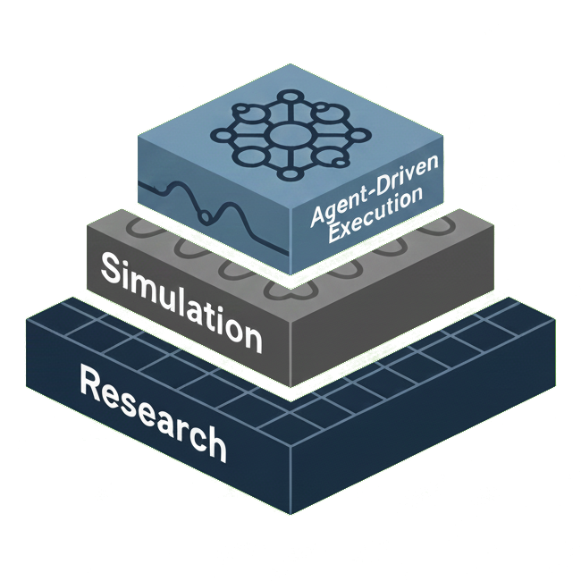

<p align="center">
  
</p>

<h1 align="center">QuantStack</h1>

<p align="center">
  <strong>An AI-native quantitative trading system — research, execution, and learning in one stack.</strong>
</p>

<p align="center">
  <a href="https://www.python.org/downloads/"></a>
  <a href="https://opensource.org/licenses/Apache-2.0"></a>
  
  
</p>

<p align="center">
  <a href="docs/architecture/README.md">Architecture</a> •
  <a href="docs/guides/quickstart.md">Quick Start</a> •
  <a href="https://github.com/kbichave/QuantStack/issues">Issues</a>
</p>

---

QuantStack replaces the traditional "strategy coded in isolation" model with a system where **Claude Code acts as the portfolio manager** — reasoning over market data, backtesting hypotheses, executing trades, and learning from outcomes across sessions.

Three trading styles, one system:

| Style | Skill | Cadence | Decision inputs |
|-------|-------|---------|-----------------|
| **Equity swing** | `/trade` | Daily | SignalEngine brief, regime, technicals |
| **Long-term investing** | `/invest` | Weekly | DCF, quality scorecard, insider flow |
| **Options** | `/options` | Per-event | IV rank, event calendar, Greeks |

The system runs **three autonomous Ralph Wiggum loops** in tmux — Strategy Factory discovers strategies, Live Trader executes them, and ML Research trains models — all with Claude Opus quality, zero human intervention. **v0.8.0** adds a coordination layer for HITL-free operation across SP500 + NASDAQ-100 + ETFs (~700 symbols). Start with `./scripts/start_supervised_loops.sh all`.

---

## How It Works

```
Claude Code (Portfolio Brain)
│  Skills: /trade  /invest  /options  /workshop  /review  /reflect  /meta
│  Memory: .claude/memory/ (strategy registry, trade journal, lessons)
│
├── get_signal_brief(symbol)   ← 2–6 seconds, no LLM calls
│   └── SignalEngine (7 concurrent Python collectors)
│       ├── Technical indicators (trend, momentum, volatility, structure)
│       ├── Regime classification (ADX + ATR + HMM)
│       ├── Volume & microstructure (OBV, VWAP, OFI)
│       ├── Risk (VaR, drawdown, liquidity headroom)
│       ├── Events (earnings, FOMC)
│       ├── Fundamentals (P/E, FCF, quality)
│       └── Sentiment (news scoring)
│
├── run_backtest_mtf / run_walkforward    ← Strategy validation
│   └── 2-stage: IS screen → OOS walk-forward → register if passing
│
├── execute_trade()
│   └── RiskGate → SmartOrderRouter → Alpaca / IBKR / eTrade / PaperBroker
│
├── Desk Agents (.claude/agents/)
│   ├── Market Intel   — macro regime, sector rotation, events
│   ├── Alpha Research — signal validation, statistical tests
│   ├── Risk           — VaR, Kelly sizing, correlation, factor exposure
│   ├── Execution      — algo selection, TCA, slippage estimation
│   ├── Strategy R&D   — backtest interpretation, overfitting detection
│   ├── Data Scientist — ML training, feature engineering, SHAP, QA gate
│   └── Watchlist      — universe screening, candidate scoring
│
├── Coordination Layer (v0.8.0)
│   ├── UniverseRegistry    — SP500 + NASDAQ-100 + 50 ETFs (~700 symbols)
│   ├── AutonomousScreener  — daily scoring → tiered watchlist (T1/T2/T3)
│   ├── EventBus            — DuckDB pub/sub for inter-loop communication
│   ├── StrategyStatusLock  — atomic CAS transitions (no race conditions)
│   ├── AutoPromoter        — evidence-based forward_testing → live + 4-week ramp
│   ├── DegradationEnforcer — bridges detector → breaker (auto-scales/trips)
│   ├── PortfolioOrchestrator — correlation, sector cap, position limit gating
│   └── LoopSupervisor      — heartbeat monitoring, crash recovery, daily digest
│
└── Three Autonomous Loops (Ralph Wiggum architecture)
    ├── Strategy Factory  — gap analysis → hypothesize → backtest → promote
    ├── Live Trader       — position monitoring → entry scan → execute
    └── ML Research       — train → QA gate → accept/reject/retrain (autoresearch-inspired)
```

**v0.6.0:** Replaced 13 LLM agents with 14 pure-Python collectors (2–6 sec, no LLM).
**v0.7.0:** Added 7 desk agents, 3 autonomous loops, 30+ ML/portfolio/NLP tools, full feature pipeline.
**v0.8.0:** Coordination layer — 700-symbol universe, tiered screening, event bus, auto-promotion, loop supervisor.

---

## Key Capabilities

### Signal Engine
Seven collectors run concurrently and produce a `SignalBrief` — a structured output with market bias, conviction score, risk environment, and regime detail. Fault-tolerant: individual collector failures don't block the brief.

### Strategy Workshop
Design and validate strategies with a full research toolkit:
- **Multi-timeframe backtesting** (`run_backtest_mtf`) — setup on H4/D1, trigger on M15/H1
- **Walk-forward validation** — IS/OOS folds with purged embargo gaps
- **Sparse-signal handling** — auto-adjusts OOS window to guarantee minimum trades per fold
- **Overfitting detection** — DSR, PBO, IS/OOS Sharpe ratio comparisons
- **ML integration** — LightGBM/XGBoost/CatBoost with SHAP explainability

### Options Trading
Full options workflow with `execute_options_trade()` MCP tool:
- Live chain fetching via Alpaca → Polygon fallback → synthetic fallback
- IV surface: `iv_rank`, `atm_iv_30d`, `skew_25d`, term structure
- Structure analysis: iron condors, credit spreads, debit spreads, straddles
- Built-in decision matrix: IV rank × regime × event → structure
- Options execution: Black-Scholes paper fills, Alpaca REST API for live
- Options-specific risk gate: premium at risk ≤ 2% equity, DTE 7–60 days

### Long-Term Investing
Fundamental investing workflow in `/invest`:
- DCF shortcut with margin-of-safety gate (≥ 20% required)
- Quality scorecard: Quality + Value + Momentum + Insider Signal (0–10)
- Conviction tiers: High → 5% equity, Moderate → 2.5%, Low → 1.25%
- Weekly review cadence — not daily signal chasing

### Autonomous Runner + Coordination (v0.8.0)
Runs unattended across SP500 + NASDAQ-100 + ETFs (~700 symbols):
- **Universe Registry** — weekly refresh from FD.ai stock screener + 50 hardcoded liquid ETFs
- **Cache Warmer** — nightly batch OHLCV fetch (delta-only, ~70s for 700 symbols)
- **Tiered Scanning** — Tier 1 (15): full SignalEngine + ML + Groq; Tier 2 (20): SignalEngine only; Tier 3 (15): monitored
- **Event Bus** — DuckDB-based pub/sub so Factory, Trader, and ML loops react to each other's changes
- **Auto-Promotion** — evidence-based `forward_testing → live` with 4-week position ramp (25% → 100%)
- **Portfolio Orchestration** — correlation check, sector cap (30%), position limit gating before execution
- **Loop Supervisor** — heartbeat monitoring, crash detection, auto-restart with exponential backoff
- **Slack Integration** — 7 channels (#agent-activity, #trades, #portfolio, #signals, #alerts, #system, #strategies) for real-time monitoring; Slack MCP for read-back and prompt optimization
- **Preflight Gate** — 11-point production readiness check (`run_preflight_check()`) validates DB, kill switch, cash, universe, strategies, risk limits, broker, and options execution before trading starts
- **Trading Operator** — single unified Ralph loop that autonomously handles strategy discovery, execution, position management, review, and ML research
- Every decision (including skips) logged to DuckDB audit trail + Slack
- `paper_mode=True` hard default; live requires explicit env var
- All coordination gated behind feature flags (`USE_TIERED_WATCHLIST`, `AUTO_PROMOTE_ENABLED`)

### Alpha Discovery
Overnight strategy generation (60-minute budget):
- Detects regime, selects parameter templates, iterates bounded grid (≤ 200 combinations)
- Two-stage filter: IS screen (fast) → OOS walk-forward
- Registers candidates as `status='draft'` — never auto-promotes, always requires human review

### Learning Loop
Signal quality degrades. QuantStack measures it:
- **IC (Information Coefficient)**: correlation between signal and forward returns
- **ICIR**: IC / IC_std — consistency metric; > 0.5 good, > 1.0 institutional-grade
- **AlphaMonitor**: rolling 30-day IC per agent; Discord alert when IC < 0
- **DegradationDetector**: live Sharpe vs IS Sharpe; flags when IS/OOS ratio > 2×
- **StrategyValidationFlow**: weekly walk-forward re-validation for all registered strategies

---

## Repository Structure

```
QuantStack/
├── packages/
│   ├── quantcore/          # Research library (200+ indicators, ML, options, RL)
│   ├── quant_pod/          # Execution system (signal engine, strategies, agents)
│   │   ├── signal_engine/  # 14 concurrent Python collectors
│   │   ├── autonomous/     # Unattended trading loop (AutonomousRunner + GroqPM + Screener)
│   │   ├── coordination/   # Inter-loop coordination (event bus, locks, promoter, supervisor)
│   │   ├── alpha_discovery/# Strategy generation (grid search + Grammar GP)
│   │   ├── features/       # FeatureEnricher (fundamentals, macro, flow, earnings)
│   │   ├── execution/      # Risk gate, order lifecycle, broker routers
│   │   ├── learning/       # IC/ICIR tracking, drift detection, prompt tuner
│   │   ├── monitoring/     # AlphaMonitor, DegradationDetector, Prometheus
│   │   ├── flows/          # TradingDayFlow, IntradayMonitorFlow, ValidationFlow
│   │   ├── guardrails/     # Signal plausibility, TradeTrap defense
│   │   ├── risk/           # Portfolio risk analyzer, correlation, factor exposure
│   │   ├── crews/          # Pydantic schemas, decoder, registry (pure Python)
│   │   └── api/            # FastAPI REST server (28 endpoints)
│   ├── alpaca_mcp/         # Alpaca broker MCP (11 tools)
│   ├── ibkr_mcp/           # Interactive Brokers MCP (11 tools)
│   └── etrade_mcp/         # eTrade MCP (OAuth 1.0a)
├── .claude/
│   ├── skills/             # Session type definitions (trade, invest, options, etc.)
│   ├── agents/             # Desk agent prompts (market-intel, risk, DS, etc.)
│   └── memory/             # Persistent brain (strategy registry, trade journal, ML experiments)
├── prompts/                # Ralph loop prompts (strategy_factory, live_trader, ml_research)
├── scripts/                # Scheduler, start_loops.sh, health checks
├── tests/
├── docs/
├── pyproject.toml          # Unified workspace (uv)
├── CLAUDE.md               # AI system operating manual
└── docker-compose.yml
```

---

## MCP Tool Surface (120+ tools)

QuantStack exposes its entire research and execution stack as MCP tools — callable directly from Claude Code without writing scripts.

### QuantCore (60+ tools)

| Category | Tools |
|----------|-------|
| **Market data** | `fetch_market_data`, `load_market_data`, `list_stored_symbols`, `get_symbol_snapshot`, `get_market_regime_snapshot`, `get_price_snapshot` |
| **Fundamentals** | `get_financial_statements`, `get_financial_metrics`, `get_earnings_data`, `get_insider_trades`, `get_institutional_ownership`, `get_analyst_estimates`, `get_company_news`, `screen_stocks`, `get_segmented_revenues`, `get_earnings_press_releases`, `list_sec_filings`, `get_sec_filing_items`, `get_company_facts`, `search_financial_statements`, `get_interest_rates`, `get_crypto_prices` |
| **Technical analysis** | `compute_technical_indicators`, `compute_all_features`, `compute_feature_matrix`, `compute_quantagent_features`, `list_available_indicators` |
| **Backtesting** | `run_backtest`, `get_backtest_metrics`, `run_walkforward`, `run_purged_cv`, `run_monte_carlo`, `run_adf_test` |
| **Signal research** | `validate_signal`, `diagnose_signal`, `detect_leakage`, `check_lookahead_bias`, `compute_alpha_decay`, `compute_information_coefficient` |
| **Statistical rigor** | `compute_deflated_sharpe_ratio`, `run_combinatorial_purged_cv`, `compute_probability_of_overfitting` |
| **Volatility** | `fit_garch_model`, `forecast_volatility` |
| **Options** | `price_option`, `price_american_option`, `compute_greeks`, `compute_implied_vol`, `compute_option_chain`, `analyze_option_structure`, `compute_multi_leg_price`, `score_trade_structure`, `simulate_trade_outcome`, `get_options_chain`, `get_iv_surface` |
| **Risk & portfolio** | `compute_position_size`, `compute_portfolio_stats`, `compute_var`, `compute_max_drawdown`, `check_risk_limits`, `stress_test_portfolio` |
| **Market microstructure** | `analyze_liquidity`, `analyze_volume_profile` |
| **Calendar & events** | `get_trading_calendar`, `get_event_calendar` |
| **Trade generation** | `generate_trade_template`, `validate_trade`, `run_screener` |

### QuantPod (60+ tools)

| Category | Tools |
|----------|-------|
| **Analysis** | `get_signal_brief`, `run_multi_signal_brief`, `get_regime` |
| **Portfolio** | `get_portfolio_state`, `get_recent_decisions`, `get_system_status`, `get_risk_metrics` |
| **Strategy** | `register_strategy`, `list_strategies`, `get_strategy`, `update_strategy`, `get_strategy_gaps`, `promote_draft_strategies`, `check_strategy_rules` |
| **Backtesting** | `run_backtest`, `run_backtest_mtf`, `run_backtest_options`, `run_walkforward`, `run_walkforward_mtf`, `walk_forward_sparse_signal` |
| **Execution** | `execute_trade`, `close_position`, `cancel_order`, `get_fills`, `get_fill_quality`, `get_position_monitor` |
| **ML pipeline** | `train_ml_model`, `tune_hyperparameters`, `review_model_quality`, `predict_ml_signal`, `train_stacking_ensemble`, `train_cross_sectional_model`, `train_deep_model`, `update_model_incremental`, `check_concept_drift` |
| **Model registry** | `register_model`, `get_model_history`, `rollback_model`, `compare_models`, `get_ml_model_status` |
| **Feature store** | `compute_and_store_features`, `get_feature_lineage` |
| **Portfolio optimization** | `optimize_portfolio`, `compute_hrp_weights` |
| **NLP** | `analyze_text_sentiment` |
| **Audit** | `get_audit_trail` |
| **Learning** | `get_strategy_performance`, `validate_strategy`, `promote_strategy`, `retire_strategy`, `get_rl_status`, `get_rl_recommendation`, `update_regime_matrix_from_performance` |
| **Orchestration** | `resolve_portfolio_conflicts`, `get_regime_strategies`, `set_regime_allocation` |
| **Decode** | `decode_strategy`, `decode_from_trades` |
| **Coordination** | `publish_event`, `poll_events`, `record_heartbeat`, `get_loop_health`, `auto_promote_eligible`, `generate_daily_digest` |

---

## Quick Start: SPY Paper Trading

Get from zero to paper trading SPY options in 5 steps:

```bash
# 1. Install
git clone https://github.com/kbichave/QuantStack.git && cd QuantStack
uv sync --all-extras

# 2. Configure (copy .env.example, fill in keys)
cp .env.example .env
# Required: FINANCIAL_DATASETS_API_KEY, ALPACA_API_KEY, ALPACA_SECRET_KEY
# Optional: SLACK_BOT_TOKEN (for monitoring), GROQ_API_KEY (for autonomous mode)

# 3. Set up Claude Code settings
cp .claude/settings.json.example .claude/settings.json
# Fill in SLACK_BOT_TOKEN and SLACK_TEAM_ID if using Slack

# 4. Run preflight check
source .env
python scripts/validate_coordination.py   # populates universe + screener
python -m quant_pod.coordination.preflight SPY  # shows what's ready / blocking

# 5. Start the Trading Operator (autonomous loop)
./scripts/start_supervised_loops.sh operator
# Monitor in Slack or: tmux attach -t quantpod-loops
```

The operator will: discover strategies via backtesting → validate via walk-forward → paper trade SPY options → monitor positions → learn from outcomes. All autonomously.

**Preflight check** (`run_preflight_check(["SPY"], 5000)`) must show READY before the operator will trade. Common blockers: missing API key, no cash balance, no validated strategies.

---

## Installation

```bash
# Prerequisites: uv (https://github.com/astral-sh/uv)
curl -LsSf https://astral.sh/uv/install.sh | sh

git clone https://github.com/kbichave/QuantStack.git
cd QuantStack

# Install everything
uv sync --all-extras

# Or install specific broker support only
uv sync --extra alpaca    # Alpaca SDK
uv sync --extra ibkr      # Interactive Brokers (ib_insync)
uv sync --extra polygon   # Polygon.io data
```

Copy `.env.example` to `.env` and fill in your keys. At minimum:

```bash
# Data + execution
ALPACA_API_KEY=...
ALPACA_SECRET_KEY=...
ALPACA_PAPER=true        # safe default

# LLM (for AlphaDiscovery and GroqPM; not needed for SignalEngine)
LLM_PROVIDER=ollama
OLLAMA_BASE_URL=http://localhost:11434
```

---

## LLM Configuration

The **Signal Engine** (primary analysis path) requires **no LLM**. LLMs are used only for:
- AlphaDiscoveryEngine (hypothesis generation)
- AutonomousRunner's GroqPM (non-routine decisions)
- `/workshop` deep reasoning

```bash
# .env — needed for AlphaDiscovery, GroqPM, sentiment scoring
LLM_PROVIDER=groq
GROQ_API_KEY=...

# Data provider (primary source for fundamentals + OHLCV)
FINANCIAL_DATASETS_API_KEY=...
DATA_PROVIDER_PRIORITY=financial_datasets,alpaca,alpha_vantage
```

---

## Broker Support

`SmartOrderRouter` selects the execution venue automatically based on which credentials are present.

| Broker | Mode | MCP server | Notes |
|--------|------|------------|-------|
| **Alpaca** | paper + live | `alpaca-mcp` | US equities; options chain requires Options Data subscription |
| **Interactive Brokers** | paper + live | `ibkr-mcp` | Equities + options; requires IB Gateway running |
| **eTrade** | paper + live | `etrade-mcp` | OAuth 1.0a, multi-leg options |
| **PaperBroker** | paper | built-in | Zero-config fallback with slippage simulation |

Priority: IBKR → Alpaca → PaperBroker. Override with `DATA_PROVIDER_PRIORITY`.

---

## Risk Controls

Hard rules enforced in `packages/quant_pod/execution/risk_gate.py`. Not bypassable.

| Rule | Default | Env override |
|------|---------|-------------|
| Max position % of equity | 10% | `RISK_MAX_POSITION_PCT` |
| Max position notional | $20,000 | `RISK_MAX_POSITION_NOTIONAL` |
| Daily loss halt | 2% | `RISK_DAILY_LOSS_LIMIT_PCT` |
| Min daily volume | 500,000 | `RISK_MIN_DAILY_VOLUME` |
| Options: max premium at risk | 2% equity | `RISK_MAX_PREMIUM_AT_RISK_PCT` |
| Options: total premium book | 8% equity | `RISK_MAX_TOTAL_PREMIUM_PCT` |
| Options: DTE at entry | 7–60 days | `RISK_MIN_DTE_ENTRY` / `RISK_MAX_DTE_ENTRY` |

Daily halt state persists via sentinel file — survives process restarts.

---

## Persistent State (DuckDB, 18 tables)

All decisions, trades, signals, and audit events are persisted locally.

| Table | What's stored |
|-------|--------------|
| `strategies` | Registry: rules, parameters, status, backtest summary, instrument type, time horizon |
| `trades` | Every trade: symbol, direction, entry/exit, P&L, regime, strategy |
| `audit_trail` | Every decision: agent, output, confidence, risk verdict |
| `positions` | Open positions: quantity, entry price, unrealized P&L |
| `regime_history` | Regime transitions: date, regime, confidence, ADX, ATR |
| `agent_skills` | IC/ICIR per agent over time |
| `outcomes` | Closed trade outcomes for learning loop |
| `options_chains` | Live options snapshots (populated by `get_options_chain`) |
| `calibration` | Confidence calibration data |
| `universe` | SP500 + NASDAQ-100 + ETF constituents (~700 symbols) |
| `screener_results` | Daily tiered watchlist scores |
| `loop_events` | Inter-loop event bus (pub/sub) |
| `loop_cursors` | Per-consumer event cursor tracking |
| `loop_heartbeats` | Loop health monitoring |

---

## Session Skills

Claude Code uses skill files to run structured sessions. Each skill is a step-by-step workflow backed by MCP tools.

| Skill | Purpose |
|-------|---------|
| `/trade` | Daily equity swing: SignalEngine → reason → decide → execute |
| `/invest` | Long-term: fundamental scorecard → DCF → margin of safety → size |
| `/options` | Short-term options: event calendar → IV rank → structure → risk check |
| `/workshop` | Strategy R&D: hypothesize → backtest → walk-forward → register |
| `/review` | Position review: P&L, DTE checks, strategy lifecycle (promote/retire) |
| `/reflect` | Weekly: outcome analysis, IC review, memory update, signal fixes |
| `/meta` | Multi-symbol orchestration: regime matrix, conflict resolution |
| `/decode` | Reverse-engineer strategies from trade history |
| `/compact-memory` | Distill memory files when they exceed 200 lines |

---

## Automated Scheduling

```bash
# Interactive sessions (scheduler)
python scripts/scheduler.py          # start scheduled sessions
python scripts/scheduler.py --run-now morning_routine

# Autonomous loops (supervised tmux)
./scripts/start_supervised_loops.sh all   # Factory + Trader + ML + Supervisor + git auto-commit
tmux attach -t quantpod-loops             # watch the loops
tmux kill-session -t quantpod-loops       # stop everything
```

| Time (ET) | Days | Session |
|-----------|------|---------|
| 09:15 | Mon–Fri | /review → /meta → /trade |
| 12:30 | Mon–Fri | /review (mid-day) |
| 15:45 | Mon–Fri | /review (pre-close) |
| 17:00 | Friday | /reflect (weekly) |

The supervised loops add: health monitoring via heartbeats, crash detection with exponential backoff restart, and automatic git commits of memory files every 5 minutes.

---

## Module Status

| Module | Status | Notes |
|--------|--------|-------|
| `signal_engine` | Stable | Primary analysis path (no LLM) |
| `features` (200+ indicators) | Stable | |
| `backtesting` | Stable | MTF, walk-forward, sparse-signal |
| `models` (ML) | Stable | LightGBM, XGBoost, CatBoost + SHAP |
| `options` | Stable | Live chain fetching + Greeks + structure scoring |
| `execution` | Stable | Risk gate, SmartOrderRouter, TCA, kill switch |
| `autonomous` | Stable | Unattended loop, GroqPM, tiered screener |
| `coordination` | Stable | Event bus, status lock, auto-promoter, supervisor, digest |
| `alpha_discovery` | Stable | Overnight discovery, 60-min budget |
| `learning` | Stable | IC/ICIR tracking, calibration, AlphaMonitor |
| `monitoring` | Stable | Degradation detection, Discord alerts |
| `portfolio` (optimization) | Stable | Mean-variance, Ledoit-Wolf shrinkage |
| `microstructure` | Stable | OFI, VPIN, Kyle's lambda |
| `rl` (reinforcement learning) | Experimental | PPO/DQN, shadow mode |
| `crews` (schemas/decoder) | Stable | Pydantic schemas + decoder (pure Python; TradingCrew removed in v0.6.0) |

---

## Development

```bash
# Run tests
uv run pytest tests/ -v

# Lint
uv run ruff check packages/

# Start QuantPod MCP server
quantpod-mcp

# Start QuantCore MCP server
quantcore-mcp

# Start REST API
quantpod-api   # http://localhost:8000

# Trigger intraday monitor manually
python -c "from quant_pod.flows.intraday_monitor_flow import IntradayMonitorFlow; print(IntradayMonitorFlow().run())"
```

### CLI Entry Points

| Command | Description |
|---------|-------------|
| `quantcore-mcp` | QuantCore MCP server (54 tools) |
| `quantpod-mcp` | QuantPod MCP server (34 tools) |
| `alpaca-mcp` | Alpaca broker MCP server |
| `ibkr-mcp` | Interactive Brokers MCP server |
| `quantpod-api` | FastAPI REST server (28 endpoints) |
| `quantpod-monitor` | Intraday monitoring loop |

---

## Disclaimer

This software is for educational and research purposes only. It is not financial advice. Do not use it for real trading without understanding the risks, implementing appropriate safeguards, and complying with applicable regulations. Past performance does not guarantee future results.

---

<p align="center">Built by Kshitij Bichave</p>
